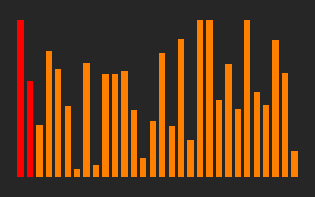
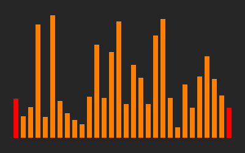
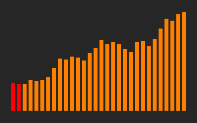

# Sorter

Visualizer for all sorts of sorting algorithms written in Haskell.
It uses some interesting implementation techniques detailed further
in the [implementation notes](#implementation-notes) section.

## Setup

Setting up with `stack`:

```
git clone $THIS_REPO
cd sorter/
stack build
```

In the following text, `./sorter` is used as a way of invoking the program.
Replace it with `stack run --` to run it through `stack`.

To check the command line help message:

```
./sorter --help
```

## Examples

Some generated animations with corresponding command lines.

#### Select sort



```
./sorter -s 30 --algorithm select
```

#### Quick sort with specilized sorting networks for partition sizes up to 6



```
./sorter -s 30 --small-nets --algorithm quick
```

#### Buble sort operating on and array that is already almost in order



```
./sorter -s 30 --nearly-sorted --algorithm bubble
```

## Implementation notes

The implementation of the sorting-algoritm-independent part of the
visualizer consists of three main components. The algorithms themselves
cand be considered to be the fourth component.

### The `Sorter` type

### Sort runner

### The animator

### Sorting algorithms

## TODO

Random ideas, in no particular order.

* Test suite
* Improvements to quick sort
  * More partitioning schemes
  * Pluggable way to select the pivot
* Visualization improvements
  * Highlight subarray currently being processed
  * Show pivot value
  * Insertion animation
* More sorting algorithms
  * insert sort
  * shell sort
  * heap sort
  * (...)
* Load array to be sorted from a file
* More options to generate the input
* Split into library and executable packages
  * Convert comments to proper haddock docs
* Sorter to use final tagless representation
* Allow colours and animation speed to be adjusted
* Allow window (and GIF) size to be adjusted
